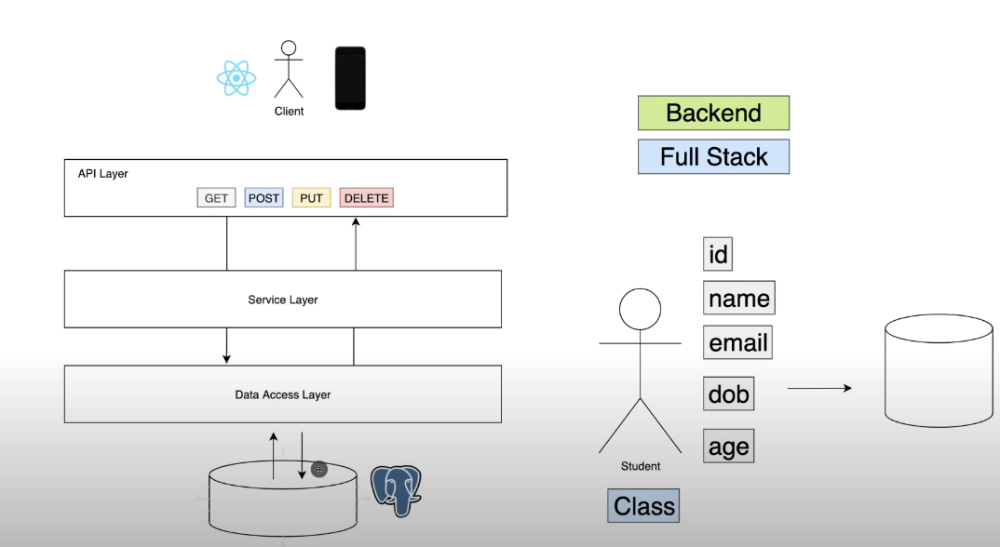

# SpringbootPractice

An example Springboot project that consists of:

- Maven
- Springboot 2.6.1
- Java 11
- PostgreSQL DB

Dependencies:
- Spring Web
- Spring Data JPA
- PostgreSQL Driver

API Layer -> Service Layer (Business Logic) -> Data Access Layer (Connecting to a DB)

NOTE: This should not work out of the box, since no postgreSQL DB is installed

